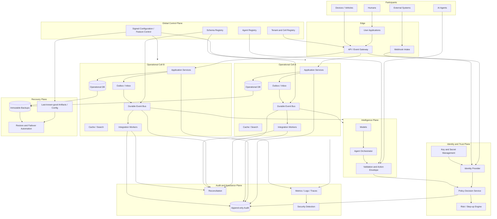

# 21 — FreightOS Security and Resilience Reference Architecture

## 1. Logical architecture

## 2. Trust boundaries

- Participant devices and external systems are untrusted.
- Gateway authentication does not replace resource authorization.
- Control-plane configuration must be signed/versioned and cached as last-known-good.
- Cells are independent blast-radius boundaries.
- Intelligence is advisory until the policy service authorizes an action envelope.
- Audit writes are separated from application data mutation.
- Recovery credentials and backups are isolated from normal production compromise paths.

## 3. Data-flow principles

- Canonical events carry scope, classification, provenance, and schema version.
- Cross-party sharing uses views/assertions rather than full object copies where possible.
- External side effects flow through connector workers with idempotency and reconciliation.
- Critical operational reads do not synchronously require AI or analytics.
- Global services should avoid synchronous per-transaction dependencies when a signed cached policy/configuration can safely suffice.

## 4. Suggested implementation technologies

Technology selection remains repository-specific. Required properties matter more than brands:

- managed identity with MFA and workload identity;
- policy-as-code or equivalent deterministic authorization;
- relational policy enforcement for tenant data;
- durable event streaming/queues;
- transactional outbox/inbox;
- managed secrets and keys;
- immutable artifact registry and signed provenance;
- OpenTelemetry-compatible tracing/metrics/logging where appropriate;
- immutable/cross-region backups;
- infrastructure as code;
- controlled feature flags and deployment rings.

## 5. Design warning

Do not turn the global control plane into a synchronous universal dependency. If every operational request requires a healthy global service, the architecture recreates a network-wide single point of failure.
