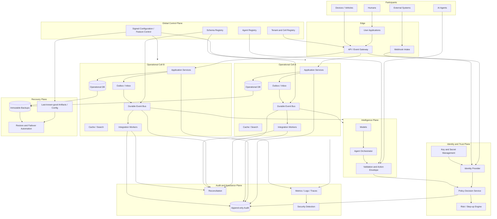

# FreightOS Security, Privacy, Resilience, and Autonomous Repair — Combined Handoff

This convenience file combines the primary handoff documents. The individual source files remain controlling for repository use.


---

<!-- SOURCE: README.md -->

# FreightOS Security, Privacy, Resilience, and Autonomous Repair Handoff

**Version:** 1.3.0  
**Status:** Production architecture and implementation handoff  
**Relationship to prior handoffs:** Additive and controlling for security, privacy, reliability, resilience, production operations, AI-agent authority, and incident response. It does not replace the FreightOS product constitution, pricing, commercial scope, or approved domain architecture unless a prior rule conflicts with a non-regression requirement in this package.

## Purpose

FreightOS is being built as a permissioned logistics coordination network through which shippers, carriers, drivers, facilities, service providers, assets, systems, and autonomous agents can communicate and execute operational workflows. A network of this scope cannot rely on best-effort security or informal uptime practices.

This package establishes the mandatory system guarantees, reference architecture, implementation sequence, evidence gates, operational runbooks, and machine-readable policy examples required to make FreightOS:

- secure by default;
- private by design;
- resilient to component and provider failure;
- contained when a component or identity is compromised;
- observable and diagnosable;
- recoverable from operator, software, infrastructure, and security failures;
- capable of bounded autonomous remediation without uncontrolled self-modification;
- safe for human and machine participants to use as an operational coordination layer.

## Governing doctrine

> FreightOS must remain useful when components fail, remain contained when components are compromised, remain accountable when participants act, and remain recoverable when prevention fails. No feature, integration, customer demand, agent capability, or delivery deadline may bypass these guarantees.

## Installation location

Copy this directory into the existing repository at:

```text
docs/production-handoff/v1.3.0-security-resilience/
```

The existing `docs/production-handoff/v1.2/00_MASTER_HANDOFF.md` should receive one additive pointer identifying this package as controlling for security, privacy, resilience, production release, and incident-response matters.

## Required reading order

1. `00_MASTER_HANDOFF.md`
2. `01_SECURITY_PRIVACY_RESILIENCE_CONSTITUTION.md`
3. `02_SECURITY_GOVERNANCE_AND_RISK_OWNERSHIP.md`
4. `03_ZERO_TRUST_IDENTITY_AUTHORIZATION.md`
5. `04_TENANT_ISOLATION_DATA_PROTECTION.md`
6. `05_DATA_CLASSIFICATION_PRIVACY_RETENTION.md`
7. `06_CELLULAR_ARCHITECTURE_RELIABILITY_DR.md`
8. `07_EVENT_BUS_IDEMPOTENCY_RECONCILIATION.md`
9. `08_SECURE_SDLC_SUPPLY_CHAIN_RELEASE.md`
10. `09_OBSERVABILITY_SLOS_ERROR_BUDGETS.md`
11. `10_INCIDENT_RESPONSE_BREACH_COMMUNICATION.md`
12. `11_AUTONOMOUS_DETECTION_CONTAINMENT_REPAIR.md`
13. `12_AI_AGENT_SECURITY_AUTHORITY.md`
14. Remaining standards, templates, policies, and schemas
15. `20_CLAUDE_MASTER_IMPLEMENTATION_PROMPT.md`

## Non-negotiable interpretation

The words **MUST**, **MUST NOT**, **REQUIRED**, **SHALL**, and **SHALL NOT** identify release-blocking requirements. **SHOULD** identifies a default that may be changed only through a documented architecture decision record with security review. **MAY** identifies an optional implementation.

## Package contents

- Constitutional security and resilience rules
- Governance and risk ownership model
- Zero-trust identity and authorization architecture
- Tenant isolation and data-protection standard
- Privacy, classification, retention, and deletion standard
- Cellular reliability and disaster-recovery architecture
- Event delivery, idempotency, and reconciliation standard
- Secure SDLC, software supply chain, and release standard
- Observability, SLO, and error-budget standard
- Incident-response and breach-communication standard
- Bounded autonomous detection, containment, rollback, and repair system
- AI-agent authority and tool-security standard
- Backup, restore, and continuity standard
- Threat model and abuse-case catalog
- Testing, verification, and chaos-engineering standard
- Vendor and integration risk standard
- Compliance and assurance readiness map
- Ordered implementation and pull-request sequence
- Acceptance gates and evidence matrix
- Claude implementation prompt
- Reference architecture and source references
- Example machine-readable policies and event schemas
- Operational templates and release checklists


---

<!-- SOURCE: 00_MASTER_HANDOFF.md -->

# 00 — Master Security and Resilience Handoff

## 1. Executive directive

FreightOS is not a conventional single-tenant application. It is intended to become a multi-party logistics coordination network that carries commercially sensitive, operationally critical, financial, identity, asset, facility, and shipment information. The platform must therefore be engineered as critical infrastructure even before it reaches critical-infrastructure scale.

Security and reliability are product capabilities. They are not optional infrastructure polish, a post-launch audit, or a compliance exercise.

## 2. Required outcomes

The implementation produced from this handoff MUST establish the following outcomes:

1. **Structural tenant isolation.** A missing application filter cannot expose another tenant's information.
2. **No implicit authority.** Human, service, device, integration, and agent actions require verified identity and explicit authorization.
3. **Bounded blast radius.** A compromised identity, integration, deployment, queue, region, or cell cannot compromise the entire network.
4. **Continuity of critical operations.** Dispatch, active shipment access, emergency service, chain-of-custody capture, and critical communication continue in a defined degraded mode when optional dependencies fail.
5. **No uncontrolled autonomous repair.** Automation may execute pre-approved containment and rollback actions, but code changes must pass normal production gates.
6. **Auditable action history.** Consequential operations are attributable, tamper-evident, and reconstructable.
7. **Safe change management.** Releases, migrations, policies, and integrations can be canaried, disabled, rolled back, and reconciled.
8. **Proven recovery.** Backups and recovery plans are tested through scheduled restore exercises.
9. **Measurable reliability.** User-visible service objectives and error budgets govern release velocity.
10. **Privacy by design.** FreightOS collects, shares, and retains only what is necessary for a defined purpose.

## 3. Precedence

When this package conflicts with a less restrictive implementation preference, this package controls. A change to a constitutional requirement requires:

- a written architecture decision record;
- a threat-model update;
- explicit approval by the designated security and platform owners;
- regression and adversarial tests;
- migration and rollback plans;
- owner approval for changes affecting network authority, cross-tenant access, financial execution, or safety-critical operations.

## 4. Architecture boundaries

FreightOS MUST separate the following planes:

- **Control plane:** identity configuration, policy, tenancy, schema registry, routing, feature control, administrative changes.
- **Operational data plane:** shipment, facility, vehicle, service, document, and settlement events required for active workflows.
- **Intelligence plane:** predictions, recommendations, embeddings, analytics, agent reasoning, and model-mediated workflows.
- **Audit plane:** append-only evidence of consequential actions and policy decisions.
- **Recovery plane:** immutable backups, restore tooling, verified infrastructure definitions, and emergency access controls.

The operational data plane MUST continue in a limited, last-known-good mode when the intelligence plane is unavailable. A control-plane outage MUST NOT automatically terminate already-authorized operational workflows.

## 5. Fail-closed versus fail-safe rules

FreightOS MUST distinguish authorization safety from operational continuity:

- **Fail closed:** identity verification, permissions, payment-destination changes, role grants, data exports, secret access, sensitive document access, agent tool escalation, destructive administration.
- **Fail safe/degraded:** display of already-authorized active assignments, offline capture of operational events, queued document upload, emergency contact and roadside request creation, local access to cached critical instructions.

No component may improvise this choice at runtime. Each workflow must declare its failure mode.

## 6. Production prohibitions

The following are prohibited:

- direct production changes from a developer laptop;
- shared application superuser credentials;
- production services connecting with database-owner privileges;
- tenant authorization based only on client-supplied identifiers;
- secrets in source code, images, logs, telemetry, prompts, or tickets;
- unrestricted production-data copies in development or test;
- destructive one-step database migrations without backward compatibility;
- AI-agent authority derived from prompt text;
- automatic deployment of AI-generated code without standard review and evidence gates;
- hidden correction or deletion of consequential audit events;
- release promotion when a critical service has exhausted its error budget without an approved emergency exception.

## 7. Required deliverables before general availability

The system is not ready for general availability until the acceptance evidence in `19_ACCEPTANCE_GATES_EVIDENCE_MATRIX.md` is complete, including:

- tenant-isolation proofs;
- zero-trust authorization tests;
- signed and reproducible build evidence;
- dependency inventory and SBOM;
- restore-drill evidence;
- regional or cell-failure exercise;
- event replay and reconciliation tests;
- incident-response exercise;
- critical-service SLO dashboards and alerts;
- agent boundary and prompt-injection tests;
- production rollback proof;
- data inventory and retention enforcement.

## 8. Implementation rule

Do not attempt to implement this package as one large pull request. Follow the ordered sequence in `18_IMPLEMENTATION_ROADMAP_PR_SEQUENCE.md`. Each pull request must leave the repository releasable, preserve prior behavior unless explicitly migrated, and include objective evidence.


---

<!-- SOURCE: 01_SECURITY_PRIVACY_RESILIENCE_CONSTITUTION.md -->

# 01 — FreightOS Security, Privacy, and Resilience Constitution

## Article I — Trust is a product obligation

FreightOS SHALL earn trust through verifiable controls rather than claims. The platform MUST provide evidence of isolation, authorization, integrity, availability, recovery, and accountable operation.

No team may represent FreightOS as breach-proof, bug-free, or incapable of outage. The engineering promise is that failures are anticipated, contained, recoverable, and prevented from becoming network-wide operational events.

## Article II — Least privilege and explicit authorization

1. Every human, service, device, integration, workload, and agent MUST have a distinct identity.
2. Every consequential request MUST be authenticated and authorized at the resource and action level.
3. Permissions MUST be deny-by-default.
4. Administrative permissions MUST be separate from normal application permissions.
5. Production roles MUST NOT be granted directly to end-user-controlled sessions.
6. Sensitive actions MUST support step-up verification, dual control, cooling periods, or transaction limits as appropriate.
7. Authorization decisions MUST be logged with policy version and decision context.

## Article III — Tenant and counterparty confidentiality

1. Each protected object MUST carry authoritative ownership or tenancy metadata assigned by trusted server-side logic.
2. Cross-tenant sharing MUST be explicit, purpose-bound, and auditable.
3. A counterparty relationship does not grant general access to an organization's records.
4. Commercially sensitive information such as carrier margins, customer rates, internal notes, maintenance strategy, and payment instructions MUST be separately authorized.
5. Tenant isolation MUST be enforced in multiple layers, including database, service, cache, storage, search, analytics, and export paths.

## Article IV — Data minimization and privacy

1. FreightOS MUST maintain a data inventory and classification for every sensitive field and event.
2. Collection MUST have a documented business purpose.
3. Retention MUST be finite unless a legal, contractual, security, or operational requirement justifies continuation.
4. Nonproduction environments MUST use synthetic, anonymized, or strongly masked data.
5. Analytics and model training MUST use the minimum necessary data and respect customer agreements and consent.
6. High-risk identity, banking, and credential data SHOULD be tokenized or verified by a specialized provider instead of stored directly.

## Article V — Integrity and nonrepudiation

1. Consequential events MUST be attributable to a verified identity.
2. Event corrections MUST preserve the original event and append the correction.
3. The audit system MUST be logically and operationally isolated from normal application writes.
4. Payment, authority, chain-of-custody, and credential changes MUST include enhanced evidence and anomaly detection.
5. Documents used to authorize or settle transactions MUST support hashing, versioning, provenance, and access history.

## Article VI — Resilience and continuity

1. Every service MUST have a criticality class, service-level objectives, recovery time objective, recovery point objective, and defined degraded mode.
2. No optional external provider may be a silent single point of failure for a Class A workflow.
3. The platform MUST use bulkheads, timeouts, circuit breakers, queues, retries, and load shedding where appropriate.
4. Critical user operations MUST be able to continue or queue safely during partial failures.
5. Backups MUST be immutable where practicable and restored on a recurring schedule.
6. Regional, cellular, and dependency failures MUST be exercised before they are relied upon.

## Article VII — Safe software delivery

1. All production changes MUST originate in version control and pass protected review and automated validation.
2. Build artifacts MUST be signed and traceable to source, builder, dependencies, and test evidence.
3. Security defects MUST receive regression tests.
4. High-risk changes MUST be canaried or feature-flagged.
5. Database changes MUST be backward compatible through expand-and-contract migration patterns.
6. Automatic rollback MUST be available for application and configuration changes that meet rollback safety requirements.
7. Emergency changes MUST be documented and reviewed after stabilization.

## Article VIII — Autonomous systems

1. Models and agents are untrusted decision-support components unless a deterministic policy engine authorizes execution.
2. Prompt content MUST NOT grant permissions, alter policies, reveal secrets, or override safety constraints.
3. Agents MUST use narrowly scoped tools and credentials.
4. Agent actions MUST have amount, frequency, object, organization, and time boundaries.
5. High-impact actions require human approval or deterministic multi-party authorization.
6. Autonomous remediation is limited to pre-approved runbooks with bounded effects and tested rollback.
7. Agent and remediation systems require kill switches independent of the model being controlled.

## Article IX — Detection, response, and disclosure

1. FreightOS MUST monitor security, correctness, availability, and data-integrity signals.
2. Incidents MUST be classified by user, operational, data, financial, safety, and legal impact.
3. Containment MUST prioritize reducing harm while preserving evidence.
4. Customer communication MUST be accurate, timely, and proportionate to verified impact.
5. Significant incidents MUST produce a postmortem, permanent corrective actions, new tests, and updated monitoring.
6. No-blame review does not remove ownership for completing corrective actions.

## Article X — Non-regression

Security and reliability controls may not be removed merely to accelerate delivery. A temporary exception must:

- identify scope and affected controls;
- include compensating controls;
- define an owner and expiration date;
- document monitoring and rollback;
- receive approval at the risk level defined in the governance standard;
- automatically expire rather than remain indefinitely.


---

<!-- SOURCE: 02_SECURITY_GOVERNANCE_AND_RISK_OWNERSHIP.md -->

# 02 — Security Governance and Risk Ownership

## 1. Objective

Establish accountable ownership for security, privacy, reliability, incident response, data governance, and agent authority. Tools do not own risk; named people and roles do.

## 2. Required roles

During the founder-led stage, one person may hold multiple roles, but responsibilities must remain distinct in records and approvals.

| Role | Required accountability |
|---|---|
| Executive Risk Owner | Accepts material business risk and approves constitutional changes |
| Security Owner | Security architecture, threat modeling, vulnerability management, incident command |
| Privacy/Data Governance Owner | Data inventory, classification, consent, retention, deletion, data-use approvals |
| Platform Reliability Owner | SLOs, error budgets, capacity, disaster recovery, production readiness |
| Identity and Authorization Owner | Identity lifecycle, policies, privileged access, authority-table integrity |
| Product Domain Owner | Correctness and degraded behavior for each logistics workflow |
| AI/Agent Safety Owner | Tool scope, agent authority, model-risk tests, kill switches |
| Incident Commander | Coordinates severe incidents independently of implementation teams |
| Evidence Custodian | Preserves audit, forensic, release, and recovery evidence |

## 3. Risk classification

Changes and incidents are classified by the maximum plausible impact:

- **R0 — Routine:** No sensitive data, authority, money, active operations, or external integration impact.
- **R1 — Controlled:** Limited noncritical workflow or internal data impact.
- **R2 — Significant:** Sensitive data, customer-visible degradation, third-party integration, or recoverable operational impact.
- **R3 — Critical:** Cross-tenant risk, identity/authorization, payments, active dispatch, chain of custody, safety-adjacent operation, destructive migration, broad outage, or agent execution authority.
- **R4 — Existential:** Network-wide compromise, systemic confidential-data exposure, unrecoverable data loss, widespread fraudulent execution, or inability to trust system history.

R3 and R4 changes require independent review and owner approval. R4 risk acceptance is not delegated.

## 4. Mandatory governance artifacts

Maintain the following in version control or a controlled evidence system:

- security and privacy risk register;
- system and data-flow diagrams;
- asset and service inventory;
- data-processing inventory;
- threat models;
- architecture decision records;
- exception register with expirations;
- vendor inventory and risk tier;
- incident register;
- SLO and error-budget history;
- backup and restore evidence;
- access-review evidence;
- release provenance and SBOMs;
- agent/tool authority registry.

## 5. Review cadence

- Critical access and role assignments: monthly during early production; quarterly after mature automation and evidence.
- Vendor and integration inventory: quarterly and upon material change.
- Threat models: at design, before GA, after significant architecture change, and after relevant incidents.
- Restore drills: at least quarterly for Class A/B data; monthly automated restore validation is preferred.
- Incident simulation: twice yearly minimum; quarterly once active network coordination is material.
- Constitutional review: annually, but updates may occur sooner as standards or risk change.
- Agent authority review: before enablement and at least quarterly.

## 6. Exceptions

Every exception record MUST include:

- control being bypassed;
- reason;
- risk statement;
- affected systems and tenants;
- compensating controls;
- detection method;
- rollback or remediation plan;
- owner;
- approver;
- creation date;
- hard expiration date.

Expired exceptions automatically become release blockers.

## 7. Security escalation rule

Any engineer, agent, operator, or reviewer may stop a release or disable a capability when there is credible risk of cross-tenant exposure, unauthorized authority, unrecoverable corruption, unsafe automated action, or material interruption of critical logistics operations. Resumption requires recorded evidence, not verbal assurance.


---

<!-- SOURCE: 03_ZERO_TRUST_IDENTITY_AUTHORIZATION.md -->

# 03 — Zero-Trust Identity and Authorization Architecture

## 1. Scope

This standard applies to humans, services, workloads, devices, vehicles, integrations, API clients, and AI agents.

## 2. Identity hierarchy

FreightOS MUST model identities separately from organizations and roles:

- **Principal:** human, service, workload, device, integration, or agent.
- **Organization:** legal or operational entity.
- **Membership:** time-bounded relationship between a principal and an organization.
- **Role:** named collection of permitted operations.
- **Grant:** assignment of role or individual permission through trusted administration.
- **Context:** device posture, location, risk, transaction value, resource relationship, and session assurance.
- **Delegation:** explicitly bounded authority granted by one authorized principal to another.

A user-controlled `actor_id`, organization ID, header, token claim, or session variable MUST NOT independently create authority.

## 3. Authentication

- Use phishing-resistant MFA for privileged and high-impact users where supported.
- Require MFA for production administration, role management, bank-account change, high-value execution, and security configuration.
- Sessions must be revocable and short-lived according to risk.
- Service-to-service identity must use workload identity or short-lived credentials rather than static shared API keys where practical.
- Device and integration credentials must be individually identifiable and revocable.
- Account recovery must not be weaker than normal authentication for the recovered authority.

## 4. Authorization

Authorization SHOULD combine role-based and attribute-based control:

```text
ALLOW only when:
  principal identity is verified
  AND membership is active
  AND requested operation is explicitly allowed
  AND resource relationship is valid
  AND tenant/counterparty scope permits access
  AND contextual risk is acceptable
  AND required approval state is satisfied
```

Authorization policy must be evaluated server-side. Client interfaces may hide unavailable actions but are not security boundaries.

## 5. Privileged access

- Production administration must use separate privileged identities.
- Standing super-administrator access is prohibited for normal work.
- Use just-in-time elevation with reason, scope, duration, and audit.
- Break-glass access must require strong authentication, generate immediate alerts, and be reviewed after use.
- Database-owner and schema-owner roles must be `NOLOGIN` or otherwise unavailable to application sessions.
- Authority-bearing tables must reject direct writes from ordinary application roles.
- Privileged actions should require four-eyes approval for R3/R4 operations.

## 6. Step-up and transaction authorization

The following actions require stronger controls than ordinary login:

- changing payment destination;
- adding or changing an organization owner;
- modifying authority policies or roles;
- large or unusual financial approvals;
- exporting sensitive data;
- disabling security controls;
- granting an agent new tools or a higher limit;
- altering immutable/audit retention;
- deleting an organization or material history;
- overriding chain-of-custody conflicts.

Controls may include reauthentication, hardware-backed MFA, dual approval, cooling periods, verified out-of-band confirmation, or transaction signing.

## 7. Authorization decision records

Record:

- principal and organization;
- action and resource;
- policy identifier/version;
- decision and reason code;
- contextual attributes used;
- approval reference;
- correlation and trace identifiers;
- timestamp.

Do not log secrets or sensitive payloads merely to explain the decision.

## 8. Required tests

- fabricated actor and organization identifiers do not confer access;
- borrowed identifiers do not alter authorization outcome;
- inactive membership is denied;
- role removal takes effect within the declared revocation SLO;
- authority-table direct writes are impossible for app roles;
- cross-tenant object IDs are denied even when guessed;
- cache and search paths enforce the same authorization as primary reads;
- agent tools cannot access resources outside their explicit scope;
- break-glass use generates evidence and alerts;
- policy rollback restores the last-known-good policy without widening access.

## 9. Reference basis

The architecture is informed by NIST SP 800-207 and NIST SP 800-207A. See `REFERENCES.md`.


---

<!-- SOURCE: 04_TENANT_ISOLATION_DATA_PROTECTION.md -->

# 04 — Tenant Isolation and Data Protection Standard

## 1. Isolation model

FreightOS SHALL enforce tenant isolation in depth. No single layer is sufficient.

Required layers:

1. trusted server-side tenancy assignment;
2. database row-level or equivalent policy enforcement;
3. service-layer authorization;
4. tenant-aware object storage;
5. tenant-aware cache keys and namespaces;
6. tenant-aware search and analytics filters;
7. export and reporting controls;
8. scoped encryption and key access for highly sensitive domains;
9. automated isolation testing in CI and production-like environments.

## 2. Data ownership and sharing

Every protected object MUST declare:

- owning organization;
- originating principal/system;
- permitted counterparties or network scopes;
- purpose of sharing;
- retention class;
- classification;
- policy version.

Cross-party logistics workflows require selective sharing. A load's operational status may be shared while internal carrier economics remain private. Data contracts must define field-level or view-level disclosure rather than exposing the complete underlying object.

## 3. Database controls

- Application roles must not own schemas, tables, functions, or migrations.
- Use separate migration/admin identities from runtime identities.
- Security-definer functions must pin `search_path`, minimize privileges, validate caller authority, and avoid dynamic SQL where possible.
- Runtime queries must not bypass tenant policy by using owner or elevated roles.
- Tenant keys and ownership fields must be immutable to ordinary users once established, except through controlled transfer workflows.
- Foreign keys and constraints should prevent cross-tenant references where the data model permits.
- Database policy tests are release-blocking.

## 4. Storage, cache, search, and analytics

- Object paths must include non-guessable identifiers and enforce authorization independent of URL secrecy.
- Signed URLs must be short-lived, audience-bound where possible, and revocable through object or policy state.
- Cache entries must include tenant, policy scope, and user-relevant authorization dimensions.
- Search indexing must carry authoritative tenant and visibility metadata.
- Analytics datasets must be isolated or transformed according to classification and customer agreements.
- Embeddings and vector indexes must not allow cross-tenant semantic retrieval unless explicitly permitted.

## 5. Encryption and secrets

- Encrypt data in transit and at rest.
- Use managed key systems with access logging and rotation.
- Separate production from nonproduction keys and secrets.
- Use envelope or field-level encryption for high-risk identity, banking, credential, and security data where justified.
- Do not store raw card or bank credentials when tokenized providers can perform the function.
- Never place secrets in logs, prompts, analytics, traces, crash reports, or support exports.
- Secret scanning is mandatory in source and build pipelines.

## 6. Nonproduction data

Production data MUST NOT be copied into lower environments without an approved process that:

- identifies the purpose;
- minimizes fields;
- irreversibly masks or synthesizes sensitive values;
- removes active credentials and tokens;
- changes contact endpoints;
- prevents messages or transactions from reaching real users/providers;
- records the copy and expiration;
- deletes the dataset after use.

## 7. Isolation incident rule

Any credible cross-tenant access path is at least an R3 incident and release blocker. Preserve evidence, disable or contain the affected path, determine whether access was possible and whether it occurred, and follow the incident standard.


---

<!-- SOURCE: 05_DATA_CLASSIFICATION_PRIVACY_RETENTION.md -->

# 05 — Data Classification, Privacy, Retention, and Deletion

## 1. Purpose

FreightOS must become a useful network without becoming an unnecessary concentration of sensitive data. Data collection and sharing are constrained by purpose, classification, contract, consent, and retention.

## 2. Classification levels

| Level | Name | Examples | Default treatment |
|---|---|---|---|
| D0 | Public | Published product information, approved public network statistics | Public release allowed through controlled publication |
| D1 | Internal | Internal procedures, non-sensitive configuration | Authenticated workforce access |
| D2 | Network Restricted | Shipment statuses shared with authorized counterparties | Purpose-bound network access and audit |
| D3 | Confidential | Rates, margins, maintenance records, facility notes, contracts | Tenant/counterparty scoped; encrypted; limited export |
| D4 | Highly Sensitive | Identity documents, bank details, credentials, security evidence, precise personal location | Strong encryption/tokenization, strict access, enhanced audit |
| D5 | Regulated/Critical | Data subject to specific legal/contractual restrictions or capable of systemic harm | Dedicated controls, explicit approval, minimal storage |

The example machine-readable policy is in `policies/data-classification.yaml`.

## 3. Data inventory requirements

For every sensitive data element or event type record:

- canonical name;
- description and business purpose;
- classification;
- originating system;
- owner and steward;
- users and systems permitted access;
- legal/contractual basis where applicable;
- sharing and model-use rules;
- retention period;
- deletion or anonymization method;
- backup expiration behavior;
- audit requirements;
- data residency restrictions;
- incident notification considerations.

## 4. Privacy-by-design rules

- Prefer a verified assertion over copying the underlying document.
- Separate identity verification from broad identity-document access.
- Separate live operational location from historical analytics.
- Reduce precision and retention when exact location is not necessary.
- Do not use customer data for generalized model training unless the agreement and consent permit it.
- Prevent prompt, embedding, telemetry, and support systems from becoming uncontrolled secondary data stores.
- Offer tenant administrators visibility into integrations and data-sharing scopes.
- Record consent and authorization changes as versioned events.

## 5. Retention classes

Each data type must use one of these default classes unless a documented rule overrides it:

- **R0 — Ephemeral:** minutes to 24 hours; transient processing and caches.
- **R1 — Short operational:** up to 90 days; retry, temporary diagnostics, low-value telemetry.
- **R2 — Active relationship:** retained while needed for active service plus a defined closure period.
- **R3 — Commercial record:** retained according to contract, tax, claims, dispute, and legal requirements.
- **R4 — Security/audit:** retained according to security and assurance need; access tightly restricted.
- **R5 — Aggregated/de-identified:** may be retained longer only when reidentification risk is controlled.

“Retain forever” is not a valid default.

## 6. Deletion and legal hold

- Deletion must propagate through primary stores, replicas, indexes, caches, and asynchronous processors.
- Backups may expire according to their immutable lifecycle rather than being selectively rewritten, provided deleted data is not restored into active use without reapplying deletion records.
- Legal holds must be documented, scoped, approved, and removed when no longer valid.
- Deletion jobs require reconciliation reports and failure alerts.

## 7. Location and driver data

Location data can create personal and commercial risk. FreightOS MUST:

- collect only required precision and frequency;
- clearly distinguish current, stale, predicted, and manually reported location;
- limit access to authorized operational purposes;
- restrict historical location queries;
- protect off-duty or nonoperational data;
- define emergency access and review;
- avoid representing stale telemetry as current.

## 8. Data-processing inventory template

Use `templates/DATA_PROCESSING_INVENTORY_TEMPLATE.md` for each domain before production enablement.


---

<!-- SOURCE: 06_CELLULAR_ARCHITECTURE_RELIABILITY_DR.md -->

# 06 — Cellular Architecture, Reliability, and Disaster Recovery

## 1. Objective

Prevent a single tenant, deployment, integration, region, database, queue, or service failure from interrupting the entire FreightOS network.

## 2. Cellular architecture

FreightOS SHOULD evolve toward independent operational cells. Each cell contains a bounded subset of tenants and the services required for their active operations:

- application workloads;
- operational database partition;
- event processing and queues;
- cache and search partition;
- integration workers;
- cell-level observability;
- cell-scoped secrets and keys where practical.

A global control layer may provide identity federation, schema registry, tenant placement, policy distribution, network discovery, and administrative coordination. The control layer MUST distribute signed, versioned, last-known-good configuration so an outage does not stop active operational processing.

## 3. Blast-radius controls

- per-cell and per-integration quotas;
- bulkheads and isolated worker pools;
- circuit breakers and strict timeouts;
- per-tenant rate limits;
- queue partitioning;
- load shedding by service criticality;
- feature and integration kill switches;
- independent deployment rings;
- bounded database connection pools;
- no global synchronous dependency on analytics or AI.

## 4. Criticality and default targets

Initial targets are in `policies/service-criticality.yaml` and `policies/slo-defaults.yaml`. They are targets to validate, not promises to market before evidence exists.

Recommended GA baselines:

| Class | Examples | Availability target | RTO | RPO |
|---|---|---:|---:|---:|
| A | Identity enforcement, active dispatch access, emergency service, event ingestion | 99.95% | 30 minutes | 5 minutes |
| B | Tendering, appointment, repair approval, documents, settlement workflow | 99.9% | 2 hours | 15 minutes |
| C | Predictions, analytics, benchmarking, nonurgent search | 99.5% | 8 hours | 4 hours |
| D | Historical exports and nonurgent administration | 99.0% | 24 hours | 24 hours |

A mature Class A service may target 99.99% only after architecture, staffing, on-call, and measured evidence support it.

## 5. Degraded operation

Each Class A/B workflow MUST document:

- unavailable dependency;
- user-visible effect;
- operations that remain available;
- state captured locally or queued;
- authorization behavior;
- reconciliation procedure;
- maximum degraded duration;
- escalation trigger.

Examples:

- AI unavailable: deterministic workflows continue; recommendations queue.
- maps unavailable: cached route and manual addresses remain; route freshness is shown.
- telematics unavailable: last-known location is labeled stale; manual check-in is allowed under policy.
- payment provider unavailable: transaction remains pending with a stable idempotency key; no blind resubmission.
- OCR unavailable: document is stored and manually classifiable.

## 6. Multi-region strategy

Do not claim active-active resilience until consistency, routing, state ownership, and failback are tested. Acceptable staged progression:

1. single region with multi-zone deployment and cross-region backups;
2. warm recovery region with tested infrastructure and data restoration;
3. selected stateless active-active services;
4. cell-aware multi-region operations;
5. active-active only for domains with proven conflict strategy.

## 7. Disaster recovery requirements

- infrastructure as code for recoverable services;
- protected and tested backup copies;
- documented dependency and secret recovery;
- DNS/routing recovery procedures;
- restoration of policy, schema, queue offsets, and object metadata;
- recovery sequencing by criticality;
- reconciliation after restore;
- periodic full and partial exercises;
- evidence that tenant boundaries remain intact after recovery.

## 8. Recovery authority

Automated failover may occur only when the failure mode and data-consistency consequences are understood and tested. Destructive failover, failback, or primary promotion requires bounded automation or approved operator action with preserved evidence.


---

<!-- SOURCE: 07_EVENT_BUS_IDEMPOTENCY_RECONCILIATION.md -->

# 07 — Event Delivery, Idempotency, and Reconciliation Standard

## 1. Principle

FreightOS must provide **exactly-once business effects**, not claim impossible universal exactly-once network delivery. Durable events may be delivered more than once; consumers must make repeated delivery safe.

## 2. Event envelope

Every consequential event MUST include:

- unique event ID;
- event type and schema version;
- producing principal/system;
- organization and cell scope;
- aggregate/resource ID;
- event occurrence time and receipt time;
- correlation and causation IDs;
- idempotency key where a command can create an external effect;
- classification and visibility metadata;
- integrity/provenance metadata;
- policy or authorization reference for commands;
- payload hash where appropriate.

## 3. Delivery controls

- durable storage before acknowledgement for critical events;
- transactional outbox or equivalent for database-to-bus consistency;
- consumer inbox/deduplication records;
- bounded retries with exponential backoff and jitter;
- dead-letter queues with ownership and alerts;
- poison-message isolation;
- schema compatibility checks;
- partitioning rules where ordering matters;
- replay controls and audit;
- backpressure and load shedding;
- retention sufficient for declared recovery and reconciliation needs.

## 4. Idempotency

Operations that dispatch service, create payments, change appointments, assign equipment, or notify external parties MUST accept or generate stable idempotency keys.

An idempotency record SHOULD capture:

- key and operation;
- requester and scope;
- normalized request hash;
- first receipt time;
- status;
- resulting resource/effect;
- response or error classification;
- expiration.

A repeated key with a materially different request must be rejected and alerted.

## 5. External connectors

Each connector MUST define:

- source-of-truth ownership;
- authentication and secret model;
- supported idempotency behavior;
- retry-safe and retry-unsafe operations;
- rate limits;
- timeout and circuit-breaker settings;
- webhook authenticity validation;
- ordering assumptions;
- reconciliation API or alternate evidence;
- degraded mode;
- kill switch.

Never blindly retry an external operation with financial, dispatch, appointment, or roadside consequences.

## 6. Reconciliation

Reconciliation is a first-class subsystem. For each material workflow compare:

- intended command;
- accepted command;
- internal state;
- external provider state;
- resulting events;
- settlement/document evidence;
- final resolved state.

Discrepancies create explicit reconciliation records with severity, owner, deadline, and resolution. The example schema is `schemas/reconciliation-record.schema.json`.

## 7. Event correction

Do not mutate history silently. Use:

- correction events;
- supersession links;
- reason codes;
- initiating principal;
- approval/evidence where required.

Consumers must be able to derive current state while preserving original history.

## 8. Required tests

- duplicate delivery does not duplicate business effect;
- crash after external acceptance but before internal commit is reconciled;
- crash after internal commit but before external request is safely retried;
- reordered events do not create invalid state;
- poison event does not block the partition indefinitely;
- replay cannot repeat irreversible effects;
- schema upgrade supports old producers/consumers during migration;
- connector outage queues or fails predictably;
- dead-letter records expose no unauthorized sensitive payloads.


---

<!-- SOURCE: 08_SECURE_SDLC_SUPPLY_CHAIN_RELEASE.md -->

# 08 — Secure SDLC, Software Supply Chain, and Production Release Standard

## 1. Development lifecycle

Security work begins with design and continues through implementation, deployment, operation, incident response, and retirement. The process is aligned to NIST SSDF, OWASP verification standards, and SLSA provenance principles. See `REFERENCES.md`.

## 2. Source control

- Protected primary and release branches.
- Pull-request review required.
- Signed commits or verified identities for sensitive repositories where feasible.
- No force-push to protected branches.
- CODEOWNERS or equivalent for identity, authorization, migrations, payments, agent tools, infrastructure, and security controls.
- Secret scanning before commit and in CI.
- Dependency update automation with risk review.

## 3. Build controls

- Builds run in isolated, ephemeral environments.
- Build definitions are version-controlled.
- Artifacts are immutable and content-addressed where possible.
- Generate SBOMs for release artifacts.
- Generate provenance linking source, workflow, builder, dependencies, and artifact digest.
- Sign artifacts and verify signatures before deployment.
- Production deployment promotes the exact tested artifact; it does not rebuild from mutable state.
- Limit and audit who can alter build and deployment workflows.

## 4. Required verification

Depending on component risk:

- type checking and linting;
- unit, integration, contract, and end-to-end tests;
- static application security testing;
- dependency and license scanning;
- infrastructure-as-code scanning;
- container and artifact scanning;
- dynamic testing for exposed services;
- authorization and tenant-isolation suites;
- migration compatibility and rollback tests;
- fuzz/property testing for parsers and policy boundaries;
- agent prompt-injection and tool-abuse tests;
- performance and capacity tests;
- manual security review for R3/R4 changes.

## 5. Release rings

Recommended promotion:

1. developer/local with synthetic data;
2. CI and ephemeral integration environment;
3. persistent staging with production-like policy;
4. internal or test tenant;
5. canary cell/tenant cohort;
6. limited percentage rollout;
7. general rollout;
8. post-deployment verification and reconciliation.

Feature flags MUST be server-controlled, audited, fail to a safe default, and have an owner and removal date.

## 6. Automated rollback

Rollback may trigger on:

- elevated error rate or latency;
- authorization anomaly;
- cross-tenant canary failure;
- event-processing backlog or duplication;
- data-integrity check failure;
- resource saturation;
- SLO burn-rate threshold;
- security signal tied to the release.

Rollback must not be automatic when it would reverse an incompatible schema migration or create data loss. Such releases require forward-fix or pretested dual-version compatibility.

## 7. Database migration standard

Use expand-and-contract:

1. add backward-compatible structure;
2. deploy readers/writers compatible with old and new forms;
3. backfill in bounded batches;
4. reconcile counts, hashes, constraints, and tenancy;
5. switch behavior gradually;
6. observe through at least one safe release window;
7. remove old structures in a later change.

Prohibit combined destructive schema change plus code dependency in one irreversible step.

## 8. Emergency changes

Emergency access does not eliminate controls. The minimum is:

- incident reference;
- named approver;
- smallest possible change;
- preserved diff and artifact;
- validation and rollback;
- post-change review within one business day;
- permanent PR and regression coverage.

## 9. Release evidence bundle

Each production release should retain:

- source commit;
- artifact digest and signature;
- SBOM;
- provenance attestation;
- test results;
- migration plan and result;
- approvals;
- canary metrics;
- deployment and rollback timestamps;
- post-deployment verification.


---

<!-- SOURCE: 09_OBSERVABILITY_SLOS_ERROR_BUDGETS.md -->

# 09 — Observability, Service-Level Objectives, and Error Budgets

## 1. User-centered reliability

Infrastructure health is not enough. FreightOS must measure whether users can complete critical logistics operations correctly and within required time.

## 2. Golden signals and correctness

Every service should expose:

- traffic/throughput;
- errors;
- latency;
- saturation;
- dependency health;
- queue age and depth;
- retry/dead-letter volume;
- data-integrity or reconciliation failures;
- authorization denials and anomalies;
- freshness of operational data;
- business success rate for critical workflows.

## 3. Required service-level indicators

Examples:

- percentage of authorized active assignments retrievable;
- percentage of critical events durably accepted within threshold;
- percentage of roadside requests acknowledged without duplicate dispatch;
- percentage of payment commands producing one reconciled effect;
- percentage of authorization changes effective within revocation target;
- percentage of documents durably stored and retrievable by authorized parties;
- percentage of telemetry shown with accurate freshness state.

## 4. Error budgets

Each SLO has an error budget. Burn-rate alerts should detect both rapid outages and slow degradation.

Release policy:

- healthy budget: normal release cadence;
- warning threshold: elevated review and reliability work;
- exhausted Class A/B budget: pause nonessential releases for the affected service;
- exception: only approved emergency/security changes or changes directly restoring reliability.

## 5. Telemetry protection

- Propagate trace and correlation IDs across services and connectors.
- Redact or tokenize sensitive fields before telemetry emission.
- Never record secrets, full identity documents, bank details, or unrestricted payloads in traces.
- Restrict security logs and audit logs separately from ordinary observability.
- Protect log integrity and retention.
- Synchronize clocks and monitor clock drift.

## 6. Alert quality

Alerts must be actionable and owned. Every production alert requires:

- condition and user impact;
- severity;
- runbook;
- responsible team/role;
- suppression/deduplication behavior;
- escalation path;
- verification of recovery.

Do not page for conditions that require no immediate action. Do not hide severe user-impact signals inside dashboards.

## 7. Synthetic and canary monitoring

Continuously test critical journeys using nonproduction or isolated synthetic principals:

- login and authorization;
- active assignment retrieval;
- event ingestion;
- document store/retrieve;
- emergency request creation without real provider dispatch;
- queue and reconciliation flow;
- cross-tenant denial;
- last-known-good policy retrieval.

## 8. Observability during incidents

Telemetry systems must not be the only evidence source. Preserve durable audit, database, queue, deployment, and provider records. Observability degradation itself is a monitored incident because operating without visibility increases risk.


---

<!-- SOURCE: 10_INCIDENT_RESPONSE_BREACH_COMMUNICATION.md -->

# 10 — Incident Response and Breach Communication Standard

## 1. Incident definition

An incident is any event that materially threatens or affects confidentiality, privacy, integrity, availability, authorization, financial correctness, safety-adjacent operation, or trust in system history.

## 2. Severity model

- **SEV-0:** Existential or network-wide compromise, systemic false execution, unrecoverable corruption, or inability to trust authority/audit state.
- **SEV-1:** Confirmed or highly credible cross-tenant exposure, privileged compromise, material Class A outage, widespread incorrect dispatch/payment/service action.
- **SEV-2:** Limited customer data or operational impact, serious integration compromise, significant Class B outage, contained financial inconsistency.
- **SEV-3:** Low-impact customer issue, limited degradation, vulnerability without observed exploitation.
- **SEV-4:** Nonincident defect or improvement tracked through ordinary work.

See `checklists/INCIDENT_SEVERITY_MATRIX.md`.

## 3. Incident roles

- Incident Commander
- Operations Lead
- Security/Forensics Lead
- Product/Domain Lead
- Communications Lead
- Legal/Privacy Adviser when applicable
- Evidence Recorder
- Executive Risk Owner for SEV-0/1

The Incident Commander coordinates; they should not be overloaded with implementing every fix.

## 4. Response lifecycle

1. Detect and validate.
2. Classify severity and declare incident.
3. Preserve evidence and establish a timeline.
4. Contain immediate harm.
5. Determine affected tenants, data, operations, and counterparties.
6. Eradicate root access or defect.
7. Restore through verified state.
8. Reconcile operations and data.
9. Communicate verified impact and required user action.
10. Complete postmortem and permanent corrective actions.

## 5. Containment priorities

- stop unauthorized or unsafe action;
- protect active users and critical operations;
- revoke or scope credentials;
- disable defective feature/integration/agent;
- isolate cell or tenant where appropriate;
- preserve audit and forensic evidence;
- avoid destructive cleanup before evidence capture;
- provide a safe fallback path.

## 6. Customer communication

Communication must be factual and avoid unsupported certainty. Include as known:

- what happened;
- when it began and ended;
- which services/data were affected;
- whether unauthorized access or incorrect operations were confirmed;
- actions FreightOS took;
- actions the customer should take;
- current status;
- next update channel or cadence during an active severe event.

Notification timing and content must comply with applicable contracts and laws; legal counsel should review material incidents.

## 7. Evidence preservation

Preserve:

- relevant logs and audit records;
- deployment and configuration versions;
- identity and authorization changes;
- queue and connector records;
- affected database/object versions;
- alert timelines;
- operator actions;
- external-provider responses;
- hashes and chain-of-custody for exported evidence.

## 8. Postmortem requirements

A SEV-0/1/2 postmortem must include:

- executive impact summary;
- detailed timeline;
- detection and response analysis;
- root cause and contributing conditions;
- blast radius;
- what worked and failed;
- customer/data/financial/operational impact;
- corrective actions with owners and dates;
- regression tests and monitoring added;
- governance or threat-model updates;
- evidence that reconciliation is complete.

Use `templates/POSTMORTEM_TEMPLATE.md`.

## 9. Reference basis

Use NIST SP 800-61 Rev. 3 and NIST CSF 2.0 as the baseline structure. See `REFERENCES.md`.


---

<!-- SOURCE: 11_AUTONOMOUS_DETECTION_CONTAINMENT_REPAIR.md -->

# 11 — Autonomous Detection, Containment, Rollback, and Repair System

## 1. Purpose

FreightOS should detect and repair operational problems quickly without allowing an automated system to make uncontrolled production changes.

## 2. Three automation levels

### Level 1 — Observe and recommend

Automation detects anomalies, correlates evidence, identifies probable cause, and proposes a runbook. No production effect.

### Level 2 — Execute bounded runbook

Automation may execute an approved, tested, reversible action within strict scope, such as:

- restart or replace an unhealthy stateless worker;
- scale a bounded worker pool;
- open a circuit breaker;
- pause a defective connector;
- disable a feature flag;
- revoke a known compromised credential;
- quarantine a message or tenant-specific job;
- roll back to a signed last-known-good artifact;
- replay a retry-safe idempotent event;
- switch read traffic to a verified replica under a tested rule.

### Level 3 — Generate a candidate code repair

Automation may reproduce the defect, generate a branch and tests, and prepare a pull request. It MUST NOT merge or deploy its own code repair without the normal evidence and approval gates.

## 3. Required runbook definition

Every autonomous runbook MUST declare:

- trigger signal and confidence threshold;
- scope and maximum blast radius;
- prerequisites;
- permitted identities/tools;
- exact actions;
- safety invariants;
- timeout;
- rollback;
- verification;
- escalation condition;
- audit fields;
- test evidence;
- owner and version.

## 4. Safety controls

- independent kill switch;
- per-action and per-time-window rate limits;
- cell/tenant/resource scoping;
- no privilege escalation;
- no modification of the policy that authorizes the runbook;
- no deletion of audit or evidence;
- two-person approval for destructive or broad actions;
- dry-run mode;
- last-known-good artifact/configuration registry;
- post-action health and reconciliation checks.

## 5. Detection sources

Use multiple signals:

- SLO burn rates;
- error and latency changes;
- authorization anomalies;
- event duplication or backlog;
- data-integrity checks;
- reconciliation mismatches;
- dependency health;
- deployment correlations;
- security alerts;
- customer-impact signals;
- synthetic transaction failures.

A single noisy metric should not trigger a broad destructive response.

## 6. Candidate repair pipeline

1. Create incident/defect record.
2. Capture relevant evidence and version state.
3. Reproduce in an isolated environment.
4. Add failing regression test.
5. Produce minimal candidate change.
6. Run full risk-appropriate test suite.
7. Generate security and migration impact analysis.
8. Create pull request with evidence.
9. Human or policy-required review.
10. Canary deployment.
11. Verify user behavior and reconciliation.
12. Promote or roll back.
13. Update runbook and threat model.

## 7. Prohibited autonomous actions

Without explicit bounded approval, automation MUST NOT:

- grant roles or permissions;
- alter bank/payment destinations;
- delete customer data;
- disable audit logging;
- modify backup retention;
- execute arbitrary shell commands in production;
- alter its own authority or kill switch;
- merge code;
- approve its own pull request;
- deploy unverified artifacts;
- make network-wide changes from a tenant-local signal.

## 8. Success measures

Track mean time to detect, contain, restore, reconcile, and permanently remediate. Do not optimize only for service restart time if the underlying state remains incorrect.


---

<!-- SOURCE: 12_AI_AGENT_SECURITY_AUTHORITY.md -->

# 12 — AI Agent Security, Authority, and Tooling Standard

## 1. Core principle

An AI model's output is untrusted input. The model may propose actions; deterministic systems decide whether those actions are authorized, valid, safe, and executable.

## 2. Agent registry

Every agent MUST have a registry record containing:

- stable agent identity;
- owner and business purpose;
- allowed organizations/tenants;
- data classification ceiling;
- allowed tools and operations;
- amount, frequency, object, geography, and time limits;
- approval requirements;
- model/provider and version policy;
- prompt/configuration version;
- monitoring and evaluation suite;
- kill switch and revocation method;
- retention and audit settings.

## 3. Action envelope

Agents do not call privileged tools with raw free-form instructions. They produce or request a validated action envelope containing:

- agent identity;
- principal/organization represented;
- intended operation;
- target resource;
- structured parameters;
- reason and supporting evidence references;
- confidence/uncertainty where relevant;
- requested authority level;
- idempotency key;
- policy context;
- expiration.

See `schemas/agent-action-envelope.schema.json`.

## 4. Prompt-injection resistance

Content from emails, documents, websites, OCR, EDI, customer notes, and retrieved knowledge is untrusted. It MUST NOT:

- change system or policy instructions;
- reveal credentials or hidden configuration;
- grant tool access;
- authorize transactions;
- cause retrieval from another tenant;
- disable logging or safety controls;
- select arbitrary network endpoints.

Separate data from instructions, validate structured outputs, restrict tools, and apply deterministic policy after the model.

## 5. Tool security

- Tools must expose narrow operations rather than general-purpose shells or database access.
- Tool inputs require schema validation and normalization.
- Tool authorization is independent of the model prompt.
- Tools must use short-lived scoped credentials.
- High-impact tools require approval or transaction signing.
- Tool results must be filtered according to the agent's data scope.
- Connector tools must defend against server-side request forgery and unapproved destinations.

## 6. Memory and retrieval

- Memory is tenant and purpose scoped.
- Retrieved content is filtered before model access.
- Embeddings inherit source classification and deletion requirements.
- Agent memory cannot become an alternate authority store.
- Sensitive conversations and tool outputs must not be used for generalized training without approval.

## 7. High-risk prohibitions

An agent may not independently:

- grant itself or others authority;
- change payment destinations;
- approve its own financial request;
- resolve chain-of-custody disputes without evidence policy;
- erase audit history;
- disable security monitoring;
- change production code and deploy it;
- expose confidential tenant information to another party;
- represent uncertain data as verified fact.

## 8. Evaluation requirements

Before enablement, test:

- direct and indirect prompt injection;
- cross-tenant retrieval attempts;
- tool-parameter manipulation;
- secret extraction;
- authority escalation;
- repeated/duplicate action generation;
- malicious document content;
- stale or conflicting data;
- model/provider outage;
- unsafe high-confidence hallucination;
- refusal and escalation behavior;
- kill-switch effectiveness.

## 9. Reference basis

Use OWASP LLMSVS/AISVS and NIST SSDF AI profile as applicable. See `REFERENCES.md`.


---

<!-- SOURCE: 13_BACKUP_RESTORE_BUSINESS_CONTINUITY.md -->

# 13 — Backup, Restore, and Business Continuity Standard

## 1. Principle

A backup is not valid evidence of recoverability until it has been restored and verified.

## 2. Backup scope

Include, as applicable:

- operational databases and transaction logs;
- object/document storage and metadata;
- audit records;
- event and queue retention required for replay;
- identity and authorization policy;
- schema registry;
- infrastructure and deployment definitions;
- encryption-key recovery material under separate protection;
- configuration and feature state;
- connector mappings and idempotency records;
- documentation and runbooks.

## 3. Protection

- encrypted backups;
- cross-account or cross-project protection for critical copies;
- cross-region copies;
- immutable/object-locked retention where practical;
- restricted deletion authority;
- backup access logging;
- separation from production credentials;
- monitoring for backup failure and unexpected volume change.

## 4. Restore tests

At minimum:

- automated sample restore and integrity validation monthly;
- Class A/B full-domain restore at least quarterly;
- cross-region recovery exercise at least twice yearly before mature multi-region claims;
- recovery from malicious deletion/corruption scenario annually;
- tenant-isolation and authorization verification after restore;
- deletion-record replay before restored data is made active.

## 5. Verification

A restore is successful only when:

- data and object counts reconcile;
- referential and domain constraints pass;
- event offsets/checkpoints are valid;
- tenant boundaries pass adversarial tests;
- critical user journeys function;
- audit history remains available;
- deletion/legal-hold state is correctly applied;
- connector and payment operations cannot duplicate effects;
- monitoring and alerting are active.

## 6. Business continuity

Maintain documented alternatives for:

- cloud-region outage;
- identity-provider outage;
- model-provider outage;
- mapping/telematics outage;
- payment/provider outage;
- notification outage;
- major connector compromise;
- workforce unavailability;
- loss of primary administrative credentials;
- supply-chain compromise of a release artifact.

## 7. Recovery sequencing

1. identity and authorization enforcement;
2. operational databases and audit evidence;
3. active shipment/dispatch and emergency service;
4. event ingestion and durable queues;
5. documents and chain-of-custody;
6. transaction and reconciliation services;
7. integrations;
8. search and analytics;
9. AI and optimization.

## 8. Restore authority

Production restore and primary promotion are R3 operations. Require a documented incident or exercise, named operator, verified target, preserved evidence, post-restore reconciliation, and approval consistent with risk.


---

<!-- SOURCE: 14_THREAT_MODEL_ABUSE_CASES.md -->

# 14 — FreightOS Threat Model and Abuse-Case Catalog

## 1. Protected assets

- tenant and counterparty confidential data;
- identity and authority state;
- active shipment and dispatch state;
- vehicle, driver, facility, and service records;
- chain-of-custody evidence;
- documents and signatures;
- payment and settlement instructions;
- provider dispatch and emergency service commands;
- audit and historical truth;
- secrets, keys, and release artifacts;
- agent tools and policy.

## 2. Threat actors

- external attackers;
- cargo thieves and identity-fraud networks;
- malicious or compromised users;
- dishonest counterparties;
- compromised vendors/integrations;
- malicious insiders;
- compromised developer/build systems;
- prompt-injection content authors;
- faulty automation and defective releases;
- opportunistic scrapers and data harvesters.

## 3. Priority abuse cases

### Identity and tenancy

- fabricated actor or organization ID obtains authority;
- user changes membership/role tables directly;
- cached object returned to the wrong tenant;
- search or vector retrieval crosses tenant boundary;
- signed URL remains usable after authorization revocation;
- support or administrator access is abused.

### Freight and chain of custody

- false carrier/driver/equipment identity at pickup;
- seal, POD, or rate document is substituted;
- event time/location is manipulated;
- unauthorized party redirects a load or changes appointment;
- duplicate or conflicting shipment events conceal theft.

### Payments and settlement

- bank destination is changed after email or credential compromise;
- duplicate payment due to retry;
- invoice or accessorial evidence is altered;
- agent approves its own payment proposal;
- compromised connector reports false settlement state.

### Vehicle/service operations

- false diagnostic or location data triggers tow/repair;
- duplicate roadside dispatch;
- provider accesses unrelated fleet records;
- compromised technician account changes repair status or estimate;
- stale telemetry is represented as live.

### AI and agent systems

- malicious document instructs agent to reveal data or use a tool;
- agent retrieves another tenant's context;
- model fabricates authorization or evidence;
- tool arguments cause SSRF or arbitrary endpoint access;
- agent increases its own limit or disables logging;
- autonomous repair modifies production without review.

### Software and infrastructure

- dependency or build pipeline is compromised;
- unsigned artifact is deployed;
- migration corrupts tenancy or authority;
- global shared service creates network-wide outage;
- ransomware deletes production and online backups;
- observability leak exposes sensitive payloads.

## 4. Required threat-model process

For each domain:

1. draw trust boundaries and data flows;
2. identify assets and actors;
3. enumerate misuse/abuse and failure scenarios;
4. assess likelihood and maximum impact;
5. map preventive, detective, containment, and recovery controls;
6. create required tests and alerts;
7. document accepted residual risk;
8. update after architecture change or incident.

Use `templates/THREAT_MODEL_TEMPLATE.md`.

## 5. Mandatory pre-GA attack simulations

- cross-tenant ID enumeration;
- fabricated authorization context;
- stolen user and service credentials;
- payment-destination takeover;
- replay and duplicate event attacks;
- malicious document prompt injection;
- compromised webhook/provider;
- build artifact substitution;
- backup deletion and restore;
- cell or regional outage;
- audit-log tampering attempt.


---

<!-- SOURCE: 15_TESTING_VERIFICATION_CHAOS_ENGINEERING.md -->

# 15 — Testing, Verification, and Chaos Engineering Standard

## 1. Testing philosophy

Tests must prove security and operational invariants, not merely code coverage. Production-critical claims require repeatable evidence.

## 2. Test layers

- unit tests for deterministic rules;
- property-based tests for parsers, policy, money, and event invariants;
- integration tests for databases, queues, storage, and identity;
- contract tests for every external integration;
- end-to-end tests for critical user journeys;
- adversarial security tests;
- migration and rollback tests;
- load, capacity, and resource-exhaustion tests;
- restore and reconciliation tests;
- agent evaluation suites;
- chaos and fault-injection exercises.

## 3. Security invariants

Examples:

- no cross-tenant read/write through any path;
- no authority from client-controlled identity fields;
- role revocation propagates within target;
- highly sensitive data never appears in logs;
- audit events cannot be edited by application roles;
- repeated idempotency key produces one business effect;
- unsigned artifact cannot deploy;
- agent cannot use unlisted tool or exceed limit;
- break-glass access alerts and expires;
- restored system preserves policies and isolation.

## 4. Chaos engineering rules

Chaos experiments must be bounded and begin outside production. Each experiment requires:

- hypothesis;
- steady-state indicator;
- maximum scope;
- abort conditions;
- rollback;
- observers;
- evidence capture;
- post-experiment review.

Priority experiments:

- terminate workers during event processing;
- delay or reorder messages;
- duplicate webhook deliveries;
- disable AI provider;
- disable maps/telematics/payment sandbox;
- saturate a tenant-specific queue;
- fail a database replica;
- make control plane unavailable while data plane continues;
- revoke credentials mid-session;
- restore a cell from backup;
- deploy a deliberately failing canary and verify rollback.

## 5. Production testing

Production tests must use isolated synthetic principals and prevent real dispatch, payment, messaging, or provider effects unless an explicitly approved live exercise requires them.

## 6. Defect closure

A severe defect is not closed until:

- root cause is understood;
- exploit/failure path is blocked;
- regression test fails on old version and passes on fixed version;
- related variants are reviewed;
- monitoring is improved;
- affected data/transactions are reconciled;
- user remediation is completed where applicable.

## 7. Independent verification

Before high-trust enterprise or network-wide activation, plan independent penetration testing and architecture review focused on tenancy, authority, payments, agent tools, integrations, and recovery. Compliance certification is not a substitute for technical testing.


---

<!-- SOURCE: 16_VENDOR_INTEGRATION_SECURITY.md -->

# 16 — Vendor and Integration Security Standard

## 1. Principle

Every connected TMS, ELD, OEM, mapping, payment, notification, OCR, storage, AI, facility, provider, or government system expands FreightOS's attack and failure surface.

## 2. Vendor tiers

- **V0 — Noncritical/public:** no sensitive data or operational dependency.
- **V1 — Business support:** limited internal or low-risk data.
- **V2 — Sensitive:** confidential data or customer-visible workflow.
- **V3 — Critical:** identity, payment, active operations, chain of custody, highly sensitive data, or Class A dependency.

V3 vendors require deeper security, resilience, exit, and incident review.

## 3. Due diligence

Assess as applicable:

- security program and independent assurance;
- encryption and key practices;
- identity, MFA, and administrative access;
- data locations, subprocessors, retention, and deletion;
- incident notification obligations;
- availability history and architecture;
- backup and disaster recovery;
- API authentication, rate limiting, idempotency, and webhook validation;
- software supply-chain practices;
- AI data use and training terms;
- portability and exit plan;
- contractual liability and audit rights.

## 4. Integration architecture

- isolate connectors in separate workers or accounts when practical;
- assign unique credentials per integration/environment;
- scope credentials to minimum permissions;
- store secrets in managed secret systems;
- validate webhook signatures and freshness;
- allowlist intended endpoints and defend against SSRF;
- enforce timeouts, rate limits, circuit breakers, and queues;
- record request/response metadata without leaking payload secrets;
- provide a connector kill switch;
- reconcile external state.

## 5. Vendor outage and compromise

Each V2/V3 integration requires:

- degraded mode;
- customer-visible freshness/status behavior;
- credential revocation plan;
- alternate provider or manual process where required;
- data-export and migration plan;
- incident contact and escalation;
- reconciliation after recovery.

## 6. AI/model providers

Contracts and architecture should address:

- whether prompts and outputs are retained or used for training;
- regional processing;
- model/version changes;
- logging and support access;
- security incident notice;
- availability and rate limits;
- content isolation;
- fallback or deterministic operation;
- ability to disable a provider without stopping core logistics workflows.

## 7. Continuous review

Inventory integrations automatically where possible. Alert on new external endpoints, credentials, packages, OAuth grants, or subprocessors that bypass review.


---

<!-- SOURCE: 17_COMPLIANCE_ASSURANCE_READINESS.md -->

# 17 — Compliance and Assurance Readiness

## 1. Purpose

FreightOS should build controls that can later support customer due diligence and independent assurance. Certification should document a functioning security program, not create one after the fact.

## 2. Baseline frameworks

Use the following as design references:

- NIST Cybersecurity Framework 2.0 for governance and risk outcomes;
- NIST SP 800-207/207A for zero trust;
- NIST SP 800-160 Vol. 2 Rev. 1 for cyber resilience;
- NIST SP 800-218 SSDF and related AI profile for secure development;
- NIST SP 800-61 Rev. 3 for incident response;
- OWASP ASVS for application verification;
- OWASP LLMSVS/AISVS for AI/LLM systems;
- SLSA for build provenance and supply-chain integrity.

See `REFERENCES.md`.

## 3. Future assurance targets

Potential business-driven targets may include SOC 2 Type II and ISO/IEC 27001 readiness. Do not claim compliance or certification until formally achieved. Legal/privacy requirements depend on jurisdiction, customer, data, and operation; qualified counsel must determine applicability.

## 4. Evidence-first design

Controls should generate evidence automatically:

- access grants and reviews;
- MFA and privileged elevation;
- code review and test results;
- artifact signatures, SBOM, and provenance;
- deployment approvals and canary results;
- vulnerability remediation;
- vendor reviews;
- backup and restore tests;
- incident exercises and postmortems;
- SLO/error-budget records;
- data inventory, deletion, and retention jobs;
- agent evaluations and authority changes.

## 5. Control mapping

Maintain an internal control catalog where one implemented control may map to multiple frameworks. Avoid separate, duplicative compliance-only processes.

Each control record should contain:

- control ID and objective;
- owner;
- systems in scope;
- implementation;
- evidence source and cadence;
- test procedure;
- exceptions;
- mapped framework references.

## 6. Customer trust package

When mature, prepare a controlled trust package containing:

- security architecture summary;
- data handling and subprocessor summary;
- business continuity overview;
- vulnerability disclosure/contact process;
- independent assessment reports under NDA as appropriate;
- penetration-test executive summary;
- incident communication commitments;
- availability history and SLO methodology;
- AI/agent control summary.

Do not disclose diagrams, secrets, exploit details, or controls in a manner that increases risk.


---

<!-- SOURCE: 18_IMPLEMENTATION_ROADMAP_PR_SEQUENCE.md -->

# 18 — Implementation Roadmap and Pull-Request Sequence

## Phase 0 — Preserve and baseline

### PR 0.1 — Install governance package

- Add this handoff directory.
- Link it from the prior master handoff.
- Add document precedence and owners.
- No runtime changes.

**Gate:** repository clean, links valid, no existing governance removed.

### PR 0.2 — Current-state inventory

- Services, databases, queues, object stores, environments, integrations, secrets, roles, data classes, critical workflows.
- Produce current architecture and gap register.

**Gate:** all production-capable components have owners and risk tiers.

## Phase 1 — Identity and tenant isolation foundation

### PR 1.1 — Principal and membership invariants

- Distinct principal, organization, membership, role, permission, and grant models.
- Trusted server-side actor and tenant context.
- Deny-by-default policy.

### PR 1.2 — Authority-table lockdown

- Runtime roles cannot directly modify authority-bearing tables.
- Controlled administrative operations with pinned search paths and audit.
- Fabricated and borrowed identity tests.

### PR 1.3 — Cross-tenant isolation suite

- Database, service, storage, cache, search, export, and agent retrieval tests.
- CI blocker.

**Phase gate:** six or more varied unauthorized identities collapse to the same denied outcome; no runtime owner/superuser access.

## Phase 2 — Audit, data protection, and privacy

### PR 2.1 — Append-only audit plane

- Consequential action and authorization decision events.
- Isolated write path and retention.

### PR 2.2 — Data classification and redaction

- Classification metadata, redaction library, logging guardrails, telemetry tests.

### PR 2.3 — Retention/deletion engine

- Versioned retention policies, deletion records, index/cache propagation, reports.

**Phase gate:** sensitive-data leak tests pass; deletion and audit behavior proven.

## Phase 3 — Reliable event and integration substrate

### PR 3.1 — Canonical event envelope and schema registry

### PR 3.2 — Transactional outbox and consumer inbox/deduplication

### PR 3.3 — Dead-letter, replay, and reconciliation system

### PR 3.4 — Connector framework with kill switches, timeouts, circuit breakers, webhook validation, and idempotency policy

**Phase gate:** crash/retry/reorder tests produce one reconciled business effect.

## Phase 4 — Observability and reliability governance

### PR 4.1 — Criticality registry and default SLOs

### PR 4.2 — User-journey SLIs, dashboards, and burn-rate alerts

### PR 4.3 — Last-known-good and degraded-mode framework

### PR 4.4 — Synthetic cross-tenant and critical-path monitoring

**Phase gate:** each Class A/B service has SLO, runbook, owner, and tested degraded behavior.

## Phase 5 — Secure delivery and recovery

### PR 5.1 — Protected release pipeline, SBOM, provenance, signing, artifact verification

### PR 5.2 — Canary and automatic rollback for safe changes

### PR 5.3 — Migration expand/contract tooling and compatibility tests

### PR 5.4 — Immutable backups, automated restore validation, recovery runbooks

**Phase gate:** exact signed artifact promoted; canary rollback and full restore proven.

## Phase 6 — Agent and autonomous repair boundaries

### PR 6.1 — Agent registry and action envelope

### PR 6.2 — Tool allowlists, policy checks, limits, approvals, and kill switches

### PR 6.3 — Prompt-injection and cross-tenant evaluation harness

### PR 6.4 — Level 1 observation and recommendation

### PR 6.5 — Selected Level 2 bounded remediation runbooks

### PR 6.6 — Level 3 candidate-fix PR generation without merge/deploy authority

**Phase gate:** agent cannot exceed tool/data/transaction scope; remediation rollback and audit proven.

## Phase 7 — Cellular and regional resilience

### PR 7.1 — Tenant/cell placement abstraction and per-cell quotas

### PR 7.2 — Cell-isolated workers, queues, and deployment rings

### PR 7.3 — Warm-region recovery and failover exercise

### PR 7.4 — Selected active-active stateless services

**Phase gate:** failure of one test cell does not materially affect another; recovery and reconciliation meet measured objectives.

## Phase 8 — External assurance readiness

- independent penetration test;
- architecture review;
- incident tabletop and technical exercise;
- control/evidence mapping;
- remediation of findings;
- production-readiness review.

## Sequencing constraints

- Do not implement agent execution before identity, policy, audit, and idempotency foundations.
- Do not implement automatic broad remediation before rollback and observability are proven.
- Do not claim multi-region resilience before exercising it.
- Do not activate financial or dispatch side effects through connectors without reconciliation.
- Do not centralize all tenants into a single blast radius while describing the system as cellular.


---

<!-- SOURCE: 19_ACCEPTANCE_GATES_EVIDENCE_MATRIX.md -->

# 19 — Acceptance Gates and Evidence Matrix

No requirement is accepted based only on code inspection or verbal assurance. Evidence must be reproducible.

| ID | Required capability | Minimum acceptance evidence |
|---|---|---|
| SEC-01 | Trusted identity context | Tests show client-supplied actor/tenant identifiers cannot create authority |
| SEC-02 | Authority table protection | Runtime roles lack direct write privileges; controlled admin operations audited |
| SEC-03 | Cross-tenant isolation | Automated DB/API/storage/cache/search/export/vector tests deny all cross-tenant paths |
| SEC-04 | Privileged access | Separate privileged identities, MFA, JIT or bounded access, break-glass alert/review |
| SEC-05 | Secret protection | Secret scans clean; no secrets in logs/images/artifacts; rotation procedure tested |
| DATA-01 | Classification inventory | Sensitive fields/events have owners, purpose, classification, retention, sharing rule |
| DATA-02 | Logging redaction | Automated tests prove D4/D5 values are excluded or irreversibly redacted |
| DATA-03 | Deletion | Deletion propagates to active stores/indexes/caches with reconciliation report |
| AUD-01 | Append-only audit | App roles cannot edit/delete consequential audit records; event attribution complete |
| EVT-01 | Idempotency | Duplicate requests/webhooks create one business effect and stable response |
| EVT-02 | Outbox/inbox | Crash-window tests do not lose or duplicate material effects |
| EVT-03 | Reconciliation | Internal/external mismatch is detected, assigned, and resolved visibly |
| REL-01 | Criticality/SLOs | Class A/B services have SLIs, SLOs, RTO/RPO, owner, dashboard, alerts, runbook |
| REL-02 | Degraded operation | AI and at least two critical external dependencies can fail without unsafe core outage |
| REL-03 | Cell isolation | Controlled failure in one cell does not spread to a separate cell |
| REL-04 | Capacity | Load test reaches declared demand plus headroom without violating critical SLO |
| DR-01 | Backup integrity | Backup success monitored; immutable/cross-region protection shown for critical data |
| DR-02 | Restore proof | Full restore completes within objective; integrity and tenant tests pass |
| DR-03 | Regional recovery | Exercise meets measured RTO/RPO and reconciles post-failover state |
| SDLC-01 | Protected delivery | Protected branches/reviews; exact tested artifact promoted |
| SDLC-02 | Supply chain | SBOM, provenance, artifact signature, and deployment-time verification |
| SDLC-03 | Safe migration | Expand/contract test and rollback/forward-fix plan proven |
| SDLC-04 | Canary rollback | Deliberately failing canary triggers bounded rollback and verification |
| IR-01 | Incident readiness | Named roles, severity matrix, contact paths, runbooks, evidence process |
| IR-02 | Exercise | Tabletop plus technical incident exercise completed with corrective actions |
| AI-01 | Agent registry | Every enabled agent has owner, purpose, tools, limits, approvals, kill switch |
| AI-02 | Deterministic policy | Agent output alone cannot authorize tool execution |
| AI-03 | Injection resistance | Direct/indirect prompt-injection, secret, cross-tenant, and tool-abuse suites pass |
| AI-04 | Bounded remediation | Runbook scope, rollback, rate limit, audit, and kill switch proven |
| AI-05 | No self-deployment | Candidate repair can open PR but cannot approve, merge, or deploy itself |
| VEN-01 | Critical vendor review | V3 vendor security, continuity, incident, data, and exit review complete |
| VEN-02 | Connector containment | Per-connector credentials, worker isolation, circuit breaker, kill switch, reconciliation |

## Evidence format

Each gate record must include:

- repository commit and environment;
- exact commands or automated workflow;
- test output and exit status;
- relevant artifact digests;
- screenshots or logs only when they do not contain sensitive data;
- reviewer and date;
- unresolved limitations;
- links to defects/exceptions.

## Release rule

A failed R3/R4 gate cannot be waived by the same person who implemented the change. Any exception must follow `02_SECURITY_GOVERNANCE_AND_RISK_OWNERSHIP.md` and have a finite expiration.


---

<!-- SOURCE: 20_CLAUDE_MASTER_IMPLEMENTATION_PROMPT.md -->

# 20 — Claude Master Implementation Prompt

Copy the prompt below into the existing Claude session that owns the FreightOS repository. Use the existing repository and branch discipline; do not create a separate product repository for these controls unless the current architecture already separates infrastructure/security code intentionally.

---

You are the principal security, platform, reliability, and production engineer for FreightOS.

A new controlling handoff package exists at:

`docs/production-handoff/v1.3.0-security-resilience/`

Read every file in that directory in the order specified by `README.md`. Also read the existing FreightOS constitution, governance, architecture, database, API, AI, DevOps, security, testing, operations, decision log, and prior production handoff files. This package is additive. Do not delete, weaken, rename, or silently reinterpret existing product scope, pricing, logistics domains, or approved functionality.

## Mission

Implement FreightOS as a secure, private, resilient, auditable, and recoverable logistics coordination network. The system must contain failures and compromises, preserve critical operations in defined degraded modes, and support bounded autonomous remediation without allowing an AI system to rewrite and deploy production code outside normal release controls.

## Non-negotiable constraints

1. Do not make major architecture, authority, data-sharing, payment, destructive migration, or production-risk decisions without recording them and escalating them for owner approval when the handoff requires it.
2. Do not perform a large-bang rewrite.
3. Follow `18_IMPLEMENTATION_ROADMAP_PR_SEQUENCE.md` in order unless a documented dependency requires a narrower preparatory change.
4. Every PR must be independently reviewable, backward compatible where required, tested, and leave the repository in a releasable state.
5. Preserve existing behavior unless a migration is explicitly approved.
6. Never use client-controlled actor IDs, organization IDs, headers, token claims, or session variables as independent proof of authority.
7. Runtime roles must not own or directly modify authority-bearing database objects.
8. Do not put production secrets or customer data in chat, commits, tests, logs, fixtures, screenshots, or prompts.
9. Do not enable live financial, dispatch, roadside, messaging, or external side effects merely to test infrastructure. Use mocks, sandboxes, or isolated synthetic tenants unless an approved live test exists.
10. AI/agent output is untrusted. Deterministic policy must authorize every action.
11. Autonomous repair may execute only approved bounded runbooks. Candidate code fixes may create branches and PRs but may not self-approve, merge, or deploy.
12. Do not claim acceptance without exact evidence.

## First assignment: Phase 0 only

Do not begin broad implementation yet. Complete the following:

### A. Repository and governance intake

- Identify current branch, HEAD, remote, working-tree state, test commands, migration commands, deployment topology, and production-capable environments.
- Verify the new handoff package is present and linked from the prior master handoff.
- Identify existing constitutional or architectural conflicts. Do not resolve a major conflict silently.

### B. Current-state security and reliability inventory

Produce a version-controlled inventory of:

- services and owners;
- databases, schemas, runtime roles, owners, and migration roles;
- identity and authorization flows;
- tenant-boundary enforcement points;
- queues, event delivery, retries, and dead letters;
- object stores, caches, search, analytics, embeddings/vector stores;
- environments, cloud accounts/projects, regions, and deployment mechanisms;
- secrets and credential classes without printing secret values;
- external integrations and side effects;
- audit/logging/telemetry systems;
- backups, restore tooling, and observed restore evidence;
- agents, tools, permissions, approval paths, and kill switches;
- critical workflows and current degraded behavior.

### C. Gap and risk register

Map the current state against every gate in `19_ACCEPTANCE_GATES_EVIDENCE_MATRIX.md`. Classify each gap R0–R4. Identify blockers in the following order:

1. cross-tenant or fabricated-authority risk;
2. privileged/runtime database ownership risk;
3. secrets and sensitive logging;
4. unrecoverable data or untested backups;
5. unsafe live external side effects and duplicate effects;
6. unaudited consequential actions;
7. unbounded agent authority;
8. missing rollback/degraded behavior;
9. remaining reliability and compliance evidence gaps.

### D. Proposed PR plan

Produce a concrete repository-specific PR sequence aligned with the handoff roadmap. For each PR specify:

- objective;
- exact files/components likely affected;
- migration impact;
- security invariants;
- tests and evidence;
- rollback;
- dependencies;
- decisions requiring owner approval.

Do not write production implementation until the Phase 0 inventory and PR plan are complete and internally consistent.

## Required completion report

Return:

- branch, HEAD, and clean/dirty state;
- files added or changed;
- exact tests/checks run and exit status;
- concise architecture summary;
- top ten risks ranked by impact;
- gate matrix status: PASS / PARTIAL / FAIL / NOT IMPLEMENTED;
- proposed first implementation PR;
- explicit owner decisions required;
- confirmation that no live operations, permissions, payment paths, or external side effects were enabled or changed.

Do not report “production ready,” “secure,” “complete,” or “accepted” unless the corresponding evidence gates pass.

---


---

<!-- SOURCE: 21_REFERENCE_ARCHITECTURE.md -->

# 21 — FreightOS Security and Resilience Reference Architecture

## 1. Logical architecture



## 2. Trust boundaries

- Participant devices and external systems are untrusted.
- Gateway authentication does not replace resource authorization.
- Control-plane configuration must be signed/versioned and cached as last-known-good.
- Cells are independent blast-radius boundaries.
- Intelligence is advisory until the policy service authorizes an action envelope.
- Audit writes are separated from application data mutation.
- Recovery credentials and backups are isolated from normal production compromise paths.

## 3. Data-flow principles

- Canonical events carry scope, classification, provenance, and schema version.
- Cross-party sharing uses views/assertions rather than full object copies where possible.
- External side effects flow through connector workers with idempotency and reconciliation.
- Critical operational reads do not synchronously require AI or analytics.
- Global services should avoid synchronous per-transaction dependencies when a signed cached policy/configuration can safely suffice.

## 4. Suggested implementation technologies

Technology selection remains repository-specific. Required properties matter more than brands:

- managed identity with MFA and workload identity;
- policy-as-code or equivalent deterministic authorization;
- relational policy enforcement for tenant data;
- durable event streaming/queues;
- transactional outbox/inbox;
- managed secrets and keys;
- immutable artifact registry and signed provenance;
- OpenTelemetry-compatible tracing/metrics/logging where appropriate;
- immutable/cross-region backups;
- infrastructure as code;
- controlled feature flags and deployment rings.

## 5. Design warning

Do not turn the global control plane into a synchronous universal dependency. If every operational request requires a healthy global service, the architecture recreates a network-wide single point of failure.


---

<!-- SOURCE: 22_DECISIONS_REQUIRED.md -->

# 22 — Owner Decisions Required Before Later Phases

The following decisions should be recorded during Phase 0 or before the listed implementation phase. Defaults below are recommendations, not silent authorization to change major architecture.

| Decision | Recommended default | Required before |
|---|---|---|
| Primary cloud and region strategy | One primary region/multi-zone, cross-region backups, warm recovery; no premature active-active claim | Phase 5 |
| Cell placement unit | Organization/enterprise as primary placement boundary, with high-volume dedicated-cell option | Phase 7 |
| Identity provider strategy | Managed identity plus internal authorization; do not build password/MFA primitives from scratch | Phase 1 |
| Policy engine | Central policy definitions with locally available enforcement/last-known-good decisions | Phase 1 |
| Highly sensitive encryption | Managed KMS plus field/envelope encryption for selected D4/D5 domains | Phase 2 |
| Audit retention | Separate restricted append-only store; duration set by risk/contract/legal review | Phase 2 |
| Event platform | Durable platform supporting partitioning, retention, replay, and access control | Phase 3 |
| Exactly-once policy | At-least-once delivery with idempotent consumers and exactly-once business effects | Phase 3 |
| Production SLOs | Adopt baseline targets from this package and revise after measured load | Phase 4 |
| Error-budget release policy | Pause nonessential Class A/B releases when budget is exhausted | Phase 4 |
| Build provenance target | Signed artifacts, SBOM, provenance; progress toward SLSA Build L3 properties | Phase 5 |
| Backup isolation | Cross-account/project and cross-region protection for critical copies | Phase 5 |
| AI provider data policy | No generalized training on FreightOS/customer prompts or outputs without explicit contractual approval | Phase 6 |
| Agent execution ceiling | Recommendation-only until identity, audit, idempotency, and approvals pass | Phase 6 |
| Autonomous remediation | Start Level 1; allow only individually approved Level 2 runbooks | Phase 6 |
| External assurance | Independent penetration test before broad enterprise/network activation | Phase 8 |

## Decisions that must not be delegated to an agent

- enabling live money movement;
- enabling autonomous dispatch or roadside execution at broad scope;
- accepting systemic residual cross-tenant risk;
- reducing audit or backup protections;
- changing data-use/training rights;
- changing constitutional guarantees;
- accepting R4 risk;
- representing FreightOS as compliant/certified or guaranteeing zero outages/breaches.


---

<!-- SOURCE: 23_INSTALLATION_AND_HANDOFF_MERGE_INSTRUCTIONS.md -->

# 23 — Installation and Existing-Handoff Merge Instructions

## 1. Objective

Install this package without overwriting or weakening the existing FreightOS production handoff. The package is an additive security, privacy, resilience, production-operations, and agent-authority layer.

## 2. Recommended repository destination

From the FreightOS repository root:

```bash
mkdir -p docs/production-handoff
cp -R /path/to/FreightOS_Security_Resilience_Handoff_v1.3.0 \
  docs/production-handoff/v1.3.0-security-resilience
```

Do not copy a downloaded ZIP directly into the repository. Extract it first and verify that `README.md`, `00_MASTER_HANDOFF.md`, and `MANIFEST.sha256` are present.

## 3. Verify package integrity

From inside the copied directory:

```bash
cd docs/production-handoff/v1.3.0-security-resilience
shasum -a 256 -c MANIFEST.sha256
```

All entries must report `OK`. If any file fails, stop and replace the package with an intact copy.

## 4. Add the controlling pointer to the existing master handoff

Add the following section to the current production master handoff. Do not remove or rewrite existing sections merely to add it.

```markdown
## Security, Privacy, Resilience, and Autonomous Repair Control Package

The controlling requirements for FreightOS security, privacy, tenant isolation, zero-trust identity and authorization, reliability, disaster recovery, secure software delivery, incident response, AI-agent authority, and bounded autonomous remediation are located at:

`docs/production-handoff/v1.3.0-security-resilience/`

This package is additive. Where a prior implementation preference conflicts with a non-regression requirement in that package, the stricter security, privacy, reliability, resilience, or authority requirement controls. Major architecture or product-scope conflicts must be escalated and documented rather than resolved silently.
```

## 5. Create a dedicated installation branch

```bash
git checkout -b setup/install-security-resilience-handoff-v1.3.0
git add docs/production-handoff/v1.3.0-security-resilience
# Also add the existing master handoff after inserting the pointer.
git status --short
```

Review the staged file list. The installation commit should contain documentation, examples, schemas, and policy definitions only. It should not change runtime code, database state, production configuration, user permissions, or live integrations.

## 6. Commit the package

```bash
git commit -m "docs: install FreightOS security and resilience handoff v1.3.0"
```

Push and open a documentation-only pull request according to the repository's existing process.

## 7. Initial Claude handoff

Use `20_CLAUDE_MASTER_IMPLEMENTATION_PROMPT.md` in the existing Claude session responsible for FreightOS. The first assignment is Phase 0 inventory and gap analysis only. Claude must not jump directly into broad production implementation.

## 8. Required first response from Claude

Claude's first completion report must contain:

- repository branch, HEAD, remote, and working-tree state;
- files changed;
- current architecture and production-capable environment inventory;
- authority and tenant-isolation findings;
- backup/restore evidence status;
- integrations and external side-effect inventory;
- agent/tool authority inventory;
- every acceptance gate marked PASS, PARTIAL, FAIL, or NOT IMPLEMENTED;
- prioritized repository-specific PR sequence;
- decisions requiring owner approval;
- explicit confirmation that no live operation or permission was changed.

## 9. Do not do these during installation

- Do not merge runtime security changes into the documentation installation PR.
- Do not rotate or paste secrets into Claude unless a separate secure operational procedure requires it.
- Do not enable agents, payments, dispatch, roadside calls, webhooks, or production integrations.
- Do not change database ownership or run migrations before the current-state inventory is complete.
- Do not represent the package as implemented merely because the documents are committed.

## 10. Acceptance of the installation PR

The installation PR is accepted when:

- package checksums pass;
- internal links and JSON schemas validate;
- the prior master handoff contains the additive pointer;
- no prior governance file was deleted or weakened;
- runtime behavior is unchanged;
- the branch is clean after commit;
- the Phase 0 Claude prompt is ready for use.


---

<!-- SOURCE: REFERENCES.md -->

# Official Reference Sources

These sources inform the architecture. They do not automatically make FreightOS compliant, certified, or secure.

1. **NIST Cybersecurity Framework 2.0**  
   https://www.nist.gov/publications/nist-cybersecurity-framework-csf-20

2. **NIST SP 800-207 — Zero Trust Architecture**  
   https://csrc.nist.gov/pubs/sp/800/207/final

3. **NIST SP 800-207A — Zero Trust for Cloud-Native Multi-Location Applications**  
   https://csrc.nist.gov/pubs/sp/800/207/a/final

4. **NIST SP 800-160 Vol. 2 Rev. 1 — Developing Cyber-Resilient Systems**  
   https://csrc.nist.gov/pubs/sp/800/160/v2/r1/final

5. **NIST SP 800-61 Rev. 3 — Incident Response Recommendations and Considerations**  
   https://csrc.nist.gov/pubs/sp/800/61/r3/final

6. **NIST SP 800-218 — Secure Software Development Framework Version 1.1**  
   https://csrc.nist.gov/pubs/sp/800/218/final

7. **NIST SP 800-218A — Secure Software Development Practices for Generative AI and Dual-Use Foundation Models**  
   https://csrc.nist.gov/pubs/sp/800/218/a/final

8. **OWASP Application Security Verification Standard**  
   https://owasp.org/www-project-application-security-verification-standard/

9. **OWASP Large Language Model Security Verification Standard**  
   https://owasp.org/www-project-llm-verification-standard/

10. **OWASP Artificial Intelligence Security Verification Standard**  
    https://owasp.org/www-project-artificial-intelligence-security-verification-standard-aisvs-docs/

11. **SLSA Specification Version 1.2**  
    https://slsa.dev/spec/v1.2/

12. **Google SRE Workbook — Implementing SLOs**  
    https://sre.google/workbook/implementing-slos/

## Version note

At package creation on 2026-08-05:

- NIST CSF 2.0 is final.
- NIST SP 800-61 Rev. 3 is final.
- NIST SP 800-218 Version 1.1 is the final SSDF publication; a Version 1.2 revision was in draft status and should not be represented as final without re-verification.
- SLSA Version 1.2 is the referenced specification.
- OWASP project versions should be pinned in implementation evidence because their project pages may evolve.
