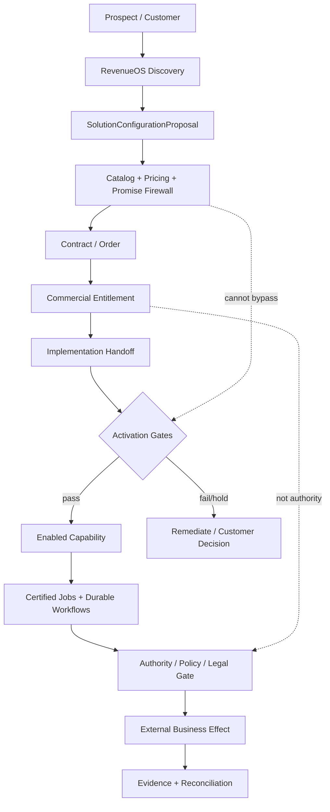

# Commercial-to-Operational Boundary

```mermaid
flowchart TD
  A[Prospect / Customer] --> B[RevenueOS Discovery]
  B --> C[SolutionConfigurationProposal]
  C --> D[Catalog + Pricing + Promise Firewall]
  D --> E[Contract / Order]
  E --> F[Commercial Entitlement]
  F --> G[Implementation Handoff]
  G --> H{Activation Gates}
  H -->|pass| I[Enabled Capability]
  H -->|fail/hold| J[Remediate / Customer Decision]
  I --> K[Certified Jobs + Durable Workflows]
  K --> L[Authority / Policy / Legal Gate]
  L --> M[External Business Effect]
  M --> N[Evidence + Reconciliation]

  D -.cannot bypass.-> H
  F -.not authority.-> L
```
