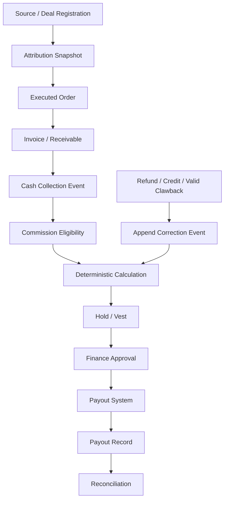

# Commission Event Chain

```mermaid
flowchart TD
  A[Source / Deal Registration] --> B[Attribution Snapshot]
  B --> C[Executed Order]
  C --> D[Invoice / Receivable]
  D --> E[Cash Collection Event]
  E --> F[Commission Eligibility]
  F --> G[Deterministic Calculation]
  G --> H[Hold / Vest]
  H --> I[Finance Approval]
  I --> J[Payout System]
  J --> K[Payout Record]
  K --> L[Reconciliation]
  M[Refund / Credit / Valid Clawback] --> N[Append Correction Event]
  N --> G
```
