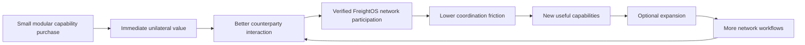

# Network Expansion Flywheel

```mermaid
flowchart LR
  A[Small modular capability purchase] --> B[Immediate unilateral value]
  B --> C[Better counterparty interaction]
  C --> D[Verified FreightOS network participation]
  D --> E[Lower coordination friction]
  E --> F[New useful capabilities]
  F --> G[Optional expansion]
  G --> H[More network workflows]
  H --> C
```
